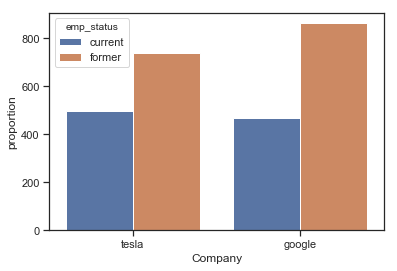
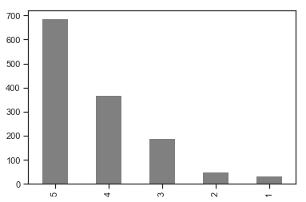
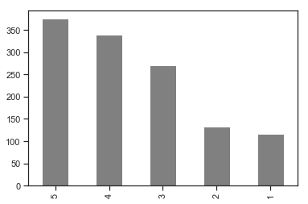
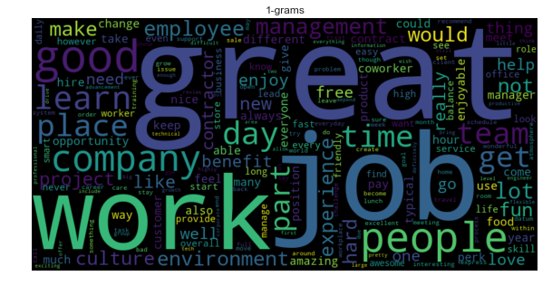
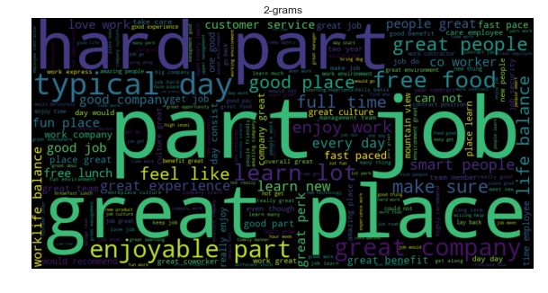
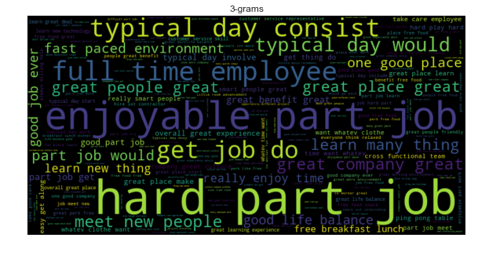
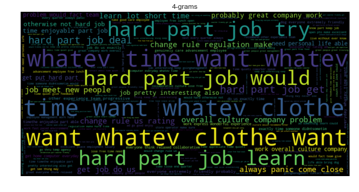
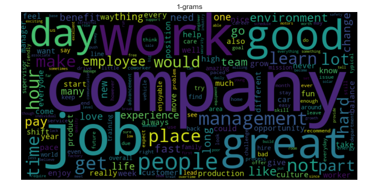
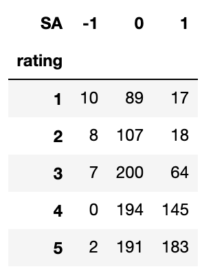

# Company Review Analysis - Sourced from Indeed
#### MSDS692 Data Science Practicum 1

## PROJECT OVERVIEW
The results of a 2018 monster.com recruiting survey say filling jobs with qualified candidates is more difficult than it was five years ago (Thibodeaux). The survey points to a good economy and an increase in open jobs as the major contributors to difficulties in attracting top talent (Thibodeaux, 2018). The goal of this project is to utilize company reviews web-scraped from Indeed to gain insight on what impacts employee satisfaction and organizational culture. These key insights could then be adopted to build a better organizational culture and an effective recruiting process that attracts more quality candidates.

The analysis for this project focuses on Google and Tesla. Google, known for its impressive organizational culture, receives two million applications a year (Schneider, 2017). While Tesla's mission to help the planet by electrifying cars is attractive to candidates, the company culture has a reputation of being intense, as it drives full throttle towards that mission (George, 2018). The perceived organizational cultures of each company will be a good measure of the accuracy of this analysis.

## DATA

For this project, the data was [web-scraped](https://github.com/chris10davies/MSDS692-Data-Science-Practicum/blob/master/web_scrape.ipynb) from Indeed using urlib.request to gather the review data and beautiful soup to parse it.

**Company Review Dataset (web-scraped from Indeed)**

2 separate datasets (Google & Tesla)

| Variable       | Description          |  Source |Type |
|:------------- |:-------------|:-----:|:-----:|
| Title     | Review title | scraped |string |
| Reviewer | Job title of the reviewer and current/former employee. | scraped |string |
| Location | Company city,  state  | scraped |string |
| Date       | Review date | scraped |date|
| Rating | Company rating (1-5) |scraped |integer |
| Review | Text of the review | scraped |string |
| State | Variable created by pulling it from location  | created |category |
| Job Title | Variable created by pulling it from reviewer      | created |string |
| Employee Status | Variable created by pulling it from reviewer      | created |category |

The featured review was repeated on every company review page that was scraped, so duplicates had to be removed.
``` python
# Code Source:
# https://gist.github.com/bbass444/273846cfe9bcefb4ec7d6c60b399935e

# Remove featured review that is reapeated on every page
google_reviews = google_reviews.drop_duplicates(keep='first')
tesla_reviews = tesla_reviews.drop_duplicates(keep='first')
```
The scraped reviews were saved off to excel to capture the reviews at a point in time. Excel was chosen as the exported format to avoid issues with punctuation interfering with re-importing the data for analysis. The number of rows were low so excel could definitely handle the volume.  

| File       |# of rows |
|:------------- |:-------------|
| Google   | 1329 |
| Tesla  | 1235 |

## EDA (EXPLORATORY DATA ANALYSIS)

#### Employee Status
First, I made a bar plot to see the proportion of reviews from current vs. former employees. Tesla had slightly more reviews from current employees while Google had more from former employees.



#### Ratings
Next, I took a look at the company review ratings. The majority of Google's reviews are rated 5 or 4 with very few 2's and 1's. Tesla also had many 5's and 4's along with a decent amount of lower ratings. This lines up with Google's mean rating of 4.2 compared to Tesla's mean rating of 3.6.

Google             |  Tesla
:-------------------------:|:-------------------------:
  |  

#### Clean Text/Count Vectorizer/Word Clouds
At first, the title and review data were combined and cleaned for text analysis. After viewing my results, it was apparent many of the reviews had the title text repeated in the review itself. This skewed the results so I cleaned only the review data for analysis. The text was tokenized, lemmatized, lowercased, and punctuation, numbers, and stop words were removed. Count vectorizer was used to get the top 10 2,3, and 4 grams for each company.

**Google**
<table>
  <tbody>
    <tr>
      <th align="left">Top 10 Word Count</th>
      <th align="center">Word Cloud</th>
    </tr>
    <tr>
      <td align="left"><b>1-gram</b><li>"great" shows up 607 times</li><li>"job" shows up 487 times</li><li>"work" shows up 479 times</li><li>"good" shows up 393 times</li><li>"people" shows up 381 times</li><li>"company" shows up 370 times</li><li>"learn" shows up 293 times</li><li>"day" shows up 287 times</li><li>"place" shows up 281 times</li><li>"time" shows up 280 times</li></ul></td>
      <td width="50%"></td>
    </tr>
    <tr>
      <td align="left"><b>2-gram</b><li>"part job" shows up 116 times</li><li>"great place" shows up 83 times</li><li>"hard part" shows up 82 times</li><li>"typical day" shows up 81 times</li><li>"enjoyable part" shows up 57 times</li><li>"great company" shows up 57 times</li><li>"learn lot" shows up 50 times</li><li>"free food" shows up 49 times</li><li>"great people" shows up 36 times</li><li>"make sure" shows up 34 times</li></ul></td>
      <td width="50%"></td>
    </tr>
    <tr>
      <td align="left"><b>3-gram</b><li>"hard part job" shows up 55 times</li><li>"enjoyable part job" shows up 35 times</li><li>"full time employee" shows up 14 times</li><li>"typical day consist" shows up 13 times</li><li>"get job to" shows up 12 times</li><li>"typical day would" shows up 8 times</li><li>"great company great" shows up 8 times</li><li>"meet new people" shows up 8 times</li><li>"great people great" shows up 7 times</li><li>"learn many thing" shows up 7 times</li></ul></td>
      <td width="50%"></td>
    </tr>
    <tr>
      <td align="left"><b>4-gram</b><li>"time want whatev clothe" shows up 607 times</li><li>"whatev time what whatev" shows up 487 times</li><li>"want whatev clothe want" shows up 479 times</li><li>"hard part job try" shows up 393 times</li><li>"hard part job would" shows up 381 times</li><li>"hard part job learn" shows up 370 times</li><li>"hard part job get" shows up 293 times</li><li>"hard part job deal" shows up 287 times</li><li>"change rule us rating" shows up 281 times</li><li>"overall culture company problem" shows up 280 times</li></ul></td>
      <td width="50%"></td>
    </tr>
  </tbody>
</table>

'Great' is the top Google 1-gram and it's interesting that 'learn' is in the top 10 as well.  2-grams has some interesting results with 'great place', 'great company', and 'great people'.  We can see why 'great' is the top single word. We get some insight that 'free food' matters as it falls into the top 10 for 2-grams. 3 and 4 grams didn't seem to provide much insight as the occurrences were relatively low.

**Tesla**
<table>
  <tbody>
    <tr>
      <th align="left">Top 10 Word Count</th>
      <th align="center">Word Cloud</th>
    </tr>
    <tr>
      <td align="left"><b>1-gram</b><li>"company" shows up 553 times</li><li>"job" shows up 483 times</li><li>"work" shows up 470 times</li><li>"great" shows up 458 times</li><li>"good" shows up 421 times</li><li>"day" shows up 365 times</li><li>"people" shows up 343 times</li><li>"management" shows up 334 times</li><li>"get" shows up 327 times</li><li>"not" shows up 317 times</li></ul></td>
      <td width="50%"></td>
    </tr>
    <tr>
      <td align="left"><b>2-gram</b><li>"part job" shows up 96 times</li><li>"great place" shows up 79 times</li><li>"long hour" shows up 65 times</li><li>"hard part" shows up 64 times</li><li>"fast pace" shows up 60 times</li><li>"typical day" shows up 54 times</li><li>"enjoyable part" shows up 43 times</li><li>"learn lot" shows up 41 times</li><li>"fast paced" shows up 40 times</li><li>"life balance" shows up 39 times</li></ul></td>
      <td width="50%"></td>
    </tr>
    <tr>
      <td align="left"><b>3-gram</b><li>"hard part job" shows up 49 times</li><li>"enjoyable part job" shows up 31 times</li><li>"fast paced environment" shows up 17 times</li><li>"part job work" shows up 8 times</li><li>"get job do" shows up 8 times</li><li>"part job would" shows up 8 times</li><li>"world transition sustainable" shows up 8 times</li><li>"day day week" shows up 7 times</li><li>"hour transition sustainable energy" shows up 7 times</li></ul></td>
      <td width="50%"></td>
    </tr>
    <tr>
      <td align="left"><b>4-gram</b><li>"accelerate world transition sustainable" shows up 6 times</li><li>"hour day day week" shows up 6 times</li><li>"word transition sustainable energy" shows up 6 times</li><li>"hour part job would" shows up 5 times</li><li>"long hour good pay" shows up 4 times</li><li>"hard part job work" shows up 3 times</li><li>"many change happen time" shows up 3 times</li><li>"together get job do" shows up 3 times</li><li>"enjoyable part job work" shows up 3 times</li><li>"hard part job hour" shows up 3 times</li></ul></td>
      <td width="50%"></td>
    </tr>
  </tbody>
</table>

'Company' is the top 1-gram for Tesla but it does not provide much insight on its own. Surprisingly, 'great' and 'good' also place in the 10 1-grams. Seeing 'management' in the 1-gram category makes you wonder what is being said about management.  The 2-grams offer some positive insights, like 'great place' and 'learn lot', and several terms that lean towards the negative like 'long hour', 'fast pace', and life balance (could be positive or negative). 'Sustainable' shows up in the 3 and 4 grams, in lower frequencies, showing some are attracted to the companies mission.

##  ANALYSIS
TextBlob was used to perform sentiment analysis on the review text, somewhat unsuccessfully.  As a crosscheck, the rating was compared to the assigned sentiment, and not everything lined up.  For example, TextBlob gave 17 reviews for Tesla a positive sentiment but the reviewers gave a rating of 1.  



Every rating for both companies has similar issues. I tried to tweak the ranges in following code for better results but always produced discrepancies.

``` python
# Code source:
# https://dev.to/rodolfoferro/sentiment-analysis-on-trumpss-tweets-using-python-

def analize_sentiment(Reviews):

    analysis = TextBlob(Reviews)
    if analysis.sentiment.polarity >= .3:
        return 1
    elif analysis.sentiment.polarity < .3 and analysis.sentiment.polarity >= -.3 :
        return 0
    else:
        return -1
```

I took a closer look at rating 1 positive sentiment reviews:
> Same as every other tech company now. They will only pay the top people what they want then the rest are left to pick up the pieces. Tesla name carries weight and they know it.

Sounds like negative sentiment to me.  Here is how TextBlob scored it.  

``` python
Sentiment(polarity=0.075, subjectivity=0.4, assessments=[(['same'], 0.0, 0.125, None), (['other'], -0.125, 0.375, None), (['only'], 0.0, 1.0, None), (['top'], 0.5, 0.5, None), (['left'], 0.0, 0.0, None)])
```
TextBlob give a high score for the word 'top' and does not recognize things like sarcasm. After a conversation with Dr. George, it the future it may be beneficial to train my own sentiment model.  

LSA/SVD
pyclustering
  silloutete
  kmedoids - top words
NMF - top words
LDA - top words
## CONCLUSIONS

## EXTRAS

Interested in the steps taken to engineer the state, job title, and job status variables from the web-scraped review data? Check out [created_variables.md](https://github.com/chris10davies/MSDS692-Data-Science-Practicum/blob/master/created_variables.md).

Time Series

Geo

## REFERENCES

Youtube Presentation

George, P. (2018, December 13). Working at Tesla Means Being in an 'Abusive Relationship' With Elon Musk: Report. Retrieved from https://jalopnik.com/working-at-tesla-means-being-in-an-abusive-relationship-1831072258

Schneider, M. (2017, July 26). Google Gets 2 Million Applications a Year. To Have a Shot, Your Resume Must Pass the '6-Second Test'. Retrieved from https://www.inc.com/michael-schneider/its-harder-to-get-into-google-than-harvard.html

Thibodeaux, W. (2018, September 19). 67 Percent of Recruiters Say It's Harder Than Ever to Find Talent. Here's How to Beat the Odds. Retrieved from https://www.inc.com/wanda-thibodeaux/67-percent-of-recruiters-say-its-harder-than-ever-to-find-talent-heres-how-to-beat-odds.html
